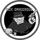
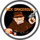

# GameShell Installers

Some Clockwork PI GameShell installer scripts.

## Instructions

Download the installer you are interested in, copy it to your Gameshell 
with **scp**. Connect to your GameShell with **ssh**, head to the
directory you did copy the installer to and launch it, for example
the rick installer:
```
source install-rick
```

***IMPORTANT***
GameShell needs to be connected to the internet. It will download
game source and data files, and icons during installation.

### Rick Dangerous


Installs the official Libretro port of [Rick Dangerous](https://github.com/libretro/xrick-libretro.git)

Start the installer on GameShell, you may choose where to put the
game icon in the menu, either in top level, Apps or Retro Games.
Apps will be created if not yet existing with icon from Micro007:


And you may choose what icon to use for the game menu item, the
default black and white one, or the black and white or colored
one from Aluqard:






The installer will explain all steps it is performing, and print out
a list of all installed files at the end.

Should there be an update of the core source in the future, simply
start the installer again, it will then download the new core source
and update your installation.

### Prince of Persia


Installs the GameShell port of [Prince of Persia](https://github.com/pleft/SDLPoP)

Start the installer on GameShell, you may choose where to put the
game icon in the menu, either in top level, Apps or Retro Games.
Apps will be created if not yet existing with icon from Micro007:


The installer will explain all steps it is performing, and print out
a list of all installed files at the end.

Should there be an update of the core source in the future, simply
start the installer again, it will then download the new source
and update your installation, however leave your current **INI**
as is, only updating game binary and data files.
